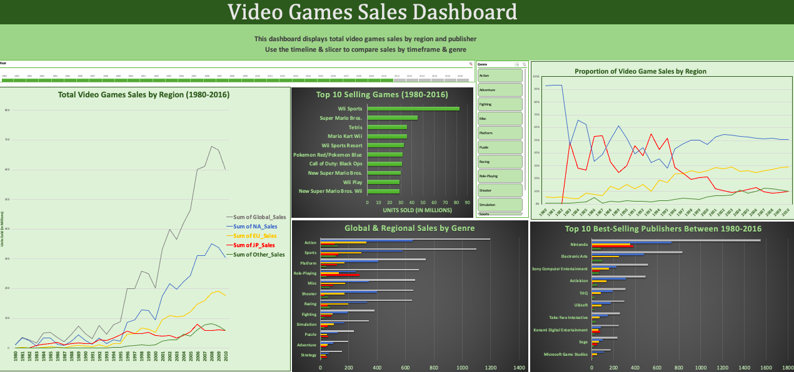
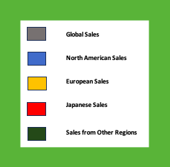
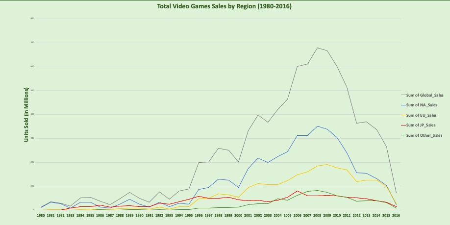
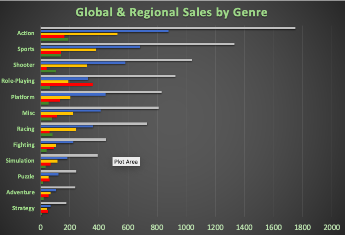
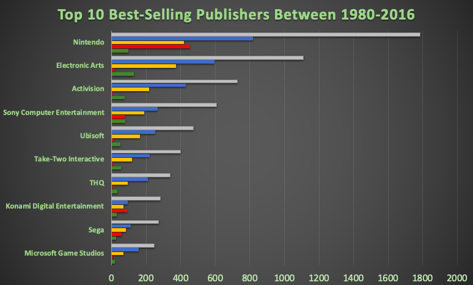
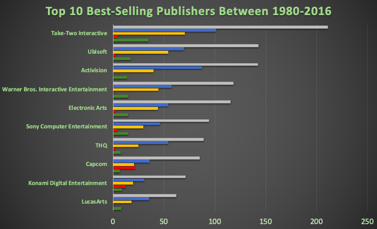
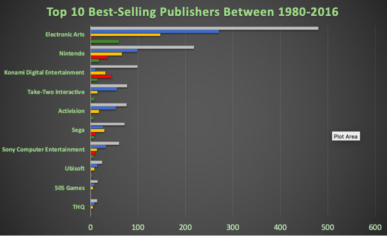

# Video Game Sales
###### This project was completed as a requirement for the Data Analytics Program by CareerFoundry

## Project Overview

#### GameCo, a fictional video game company, aims to leverage data insights to guide the development of new games. To support this initiative, you have been tasked with conducting a descriptive analysis of a video game sales dataset. The goal is to gain a deeper understanding of market performance trends and provide actionable insights for future game releases. Additionally, you have been asked to design an interactive dashboard that visualizes sales trends across various categories to aid in strategic decision-making.

#### The target audience/key stakeholders are GameCo's executives, including the following:
##### ● Vice President of Marketing
##### ● Chief Financial Officer
##### ● Senior Vice President of Sales

## Key Questions
#### GameCo executives are open to hearing any insights you can pull from the data but are specifically interested in these questions:
##### ● Are certain types of games more popular than others?
##### ● What other publishers will likely be the main competitors in certain markets?
##### ● Have any games decreased or increased in popularity over time?
##### ● How have their sales figures varied between geographic regions over time?

## Data

#### This data was drawn from the website VGChartz.

#### Important points regarding the data set:
##### ● It tracks the total number of units of games sold (not financial figures) from 1980 to 2016.
##### ● The numbers represent units sold in millions. When you see the number “1.2,” for instance, this represents a total of 1.2 million units sold.
#### Download the video game sales data set: https://images.careerfoundry.com/public/courses/intro-to-data/E1/vgsales.xlsx
##### To get a better sense of the approach used to gather and correlate this data, take a look at VGChartz’s methodology: http://vgchartz.com/methodology.php

## Tools and Skills
#### Tools: Microsoft Excel
#### Skills: Data Cleaning, Grouping and Summarizing Data, Descriptive Analysis, Developing Insights, Data Visualizations, Storytelling/Presenting Data

## Final Dashboard
#### To view the dashboard (and further details for the analysis), download the “vg_sales.xlsx” file. The dashboard includes the following charts: Total video game sales by region; proportion of sales by region; top selling 10 publishers; top selling genres; and top 10 selling games. The dashboard can be adjusted according to time frame and video game genre, using the slicer.

## Steps to Analysis

##### Step 1. Initial Exploration (Yellow Tab on Excel Worksheet)
##### Step 2. Data Cleaning (Orange Tabs)
##### Step 3. Descriptive Analysis (Blue Tabs)
##### Step 4. Create Visualizations for Dashboard (Blue Tabs)
##### Step 5. Create Dashboard (Green Tabs)
##### Step 6. Record Insights and Provide Recommendations (Green Tabs)

## Key Insights & Trends

#### Use this legend for all of the following visualizations. All sales are measured in the total number of units sold (not by currency).

#### 1) There was a steady rise in global sales of hardware games (in all regions) from 1980-2008/2009, before a steep decline from 2010-2016

###### Sales data during the period of a steep decline may be misleading due to a shift to digital gaming

#### 2) North America has been the most dominant market since the early 1990s

###### Europe took over as the 2nd leading market a few years after and its sales continued to rise until the global decline
###### Japan's sales have remained stagnant between the 1990s-2000s (before a brief rise between 2004-2006)

#### 3) The top 3 most popular game genres globally were Action, Sports and Shooter
###### In Japan, Role-Playing was the most popular genre; Shooter games were not as popular as in Europe and North America
###### Racing and Platform games were also particularly popular in North America and Europe

#### 4) The top 3 selling publishers were Nintendo, Electronic Arts and Sony Computer Entertainment
###### Nintendo was the most popular in all three major regions
###### Electronic Arts was not popular at all in Japan
###### Activision was also popular in North America (3rd most popular in this region, and 4th most popular globally)

#### 5) Insights for Action games - the top selling genre:

###### Nintendo (the most popular publisher) was not in the top 10 publishers of Action games.
###### The top 5 publishers of Action games were Take-Two Interactive, Activision, EA, THQ, and Ubisoft. These publishers sold more action games in the "other regions" category than in Japan.
###### Capcom was by far the best selling publisher for Action games in Japan (and 6th overall)

###### * Action Games Only

#### 6) Insights for Sports games - the second top selling genre:

###### Electronic Arts sold the most sports games, followed by Nintendo, Konami and Activision
###### Electronic Arts sold very well in North America, Europe and Other Regions but not at all in japan
###### Nintendo sports games sold well in all regions 
###### Konami sold better in Japan, Europe and other regions than in North America
###### Activision was the second third best selling publisher of sports games in North America

*Sports Games Only

## Recommendations

#### The following recommendations are a result of my descriptive analysis of global video games sales between 1980-2016. 

#### 1. Data Reliability Check: 
###### Investigate the reliability of sales data post-2010 due to a likely shift towards digital gaming, which may have led to a decline in reported sales. Determine if Japan experienced a similar transition earlier, causing the observed "stagnation" in sales.

#### 2. Publisher Strategy: 
###### Conduct targeted research on publishers’ genre strengths and regional performance. For instance, explore opportunities for Electronic Arts to expand into Japan by adapting their popular sports franchises to include elements of Role-Playing games, a genre preferred in Japan. 
###### Evaluate whether publishers should diversify into new genres or continue focusing on their existing strengths, such as Nintendo’s dominance in Role-Playing and Take-Two’s success in Action games.

#### 3. Digital and Mobile Gaming Transition: 
###### Analyze the potential success of different genres and publishers in the digital and mobile gaming market. Identify which publishers have established a strong presence in these platforms and assess whether traditional console and PC genres can adapt to digital/mobile formats.

#### 4. North American Marketing Strategy: 
###### Focus on promoting games from the top global publishers—Nintendo, EA, Sony—and Activision, which is particularly popular in North America. Target key genres such as Action, Sports, Shooter, Racing, Role-Playing, and Platform games through tailored campaigns.

#### 5. European Marketing Strategy: 
###### Apply a similar strategy as in North America, highlighting top publishers and popular genres. Adapt the messaging and campaigns to align with regional preferences and platforms favored by European gamers.

#### 6. Japanese Marketing Strategy: 
###### Prioritize Role-Playing games in marketing efforts, followed by the top globally selling genres, to align with Japanese gamers’ preferences. Consider developing or localizing content that blends traditional Japanese gaming elements with global bestsellers.

